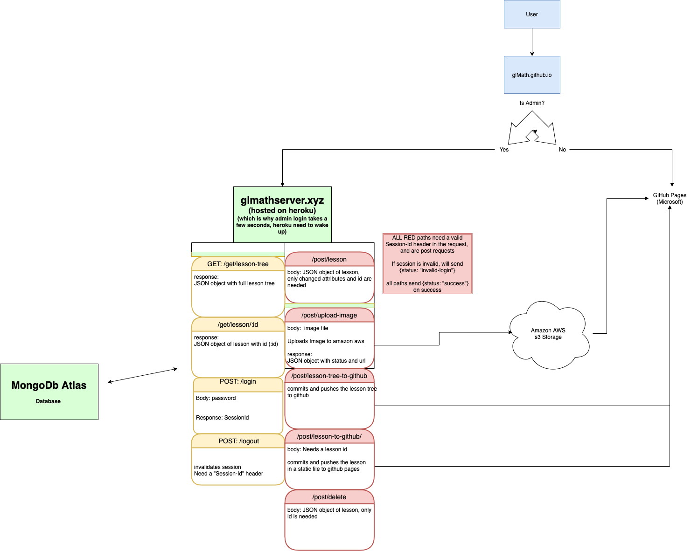

# glmath.github.io
## A math education learning platform designed for ease of use for both students and educators
### [Click here to go to GLMath](https://glmath.github.io)

### System Design Philosophy
A key part of the design was to build in redundancy in a way that no matter how many students connected at once, the system would never fail. 
This was achieved by separating the admin and user pages
- The admin lessons are loaded from a database and served by a node js app, which allows for extensive and fast editing 
- When edits are done, admin can publish the lessons
- Published lessons are hosted statically on github pages, and will always be available even if node js server is down
- All the load balancing and scalability issues are handled by github pages

### Technology Stack
- MongoDb Atlas for the database
- Node JS and Express server Hosted on Heroku 
- React used for frontend app
- Frontend hosted on github pages
- Images stored on Amazon S3 Object Storage

### System and api diagram:

